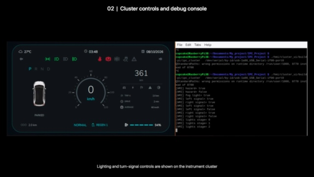

# IPC Automotive Project

Automotive IPC/VCU prototype with an Arduino Uno motor ECU, a Raspberry Pi 3B+
VCU, and an ESP32 keypad controller over MQTT. The repository contains
firmware, control logic, a shared CAN database, the C++ backend, and the Qt/QML
instrument cluster. Built as a hands-on embedded C/C++ and Qt portfolio project.

## Demo

[Watch the hardware demo](https://github.com/Cupcake137/IPC_Project/releases/download/v1.0.0-review/IPC_Project_Demo_HW_2026-10-08.mp4)
or open the [demo release](https://github.com/Cupcake137/IPC_Project/releases/tag/v1.0.0-review).

The 2-minute 45-second recording shows the assembled hardware, individual
controllers, cluster/debug output, keypad interaction and gear-dependent motor
control. Captions describe the prototype without claiming physical CAN or
measured road speed. Video is hosted as a release asset, not in Git history.



## Implemented Features

- Uno throttle/gear inputs and bidirectional PWM motor control through L298.
- Pi VCU state machine, ECO/NORMAL/SPORT authorization and Reverse output limit.
- Six shared CAN-shaped messages with payload CRC and alive counters, carried
  over UART and MQTT without an MCP2515 or a physical CAN bus.
- ECU command watchdog and VCU fresh-Drive watchdog, critical DTC latch and
  safe fault-clear interlocks.
- Qt/QML speed animation, vehicle state, telltales and five keypad-driven menu pages.
- Hardware-mode ODO/Trip storage and regression tests for control, UART, menus
  and distance calculations.

## Release Snapshot

The project owner reported successful operation of the updated source on the
Raspberry Pi hardware setup on 2026-10-08, after the final UART watchdog
correction. Local C reference, backend and HMI regression tests passed.
See [Release Notes](docs/RELEASE_NOTES.md) for validation boundaries and
[Final Source Review](docs/FINAL_REVIEW.md) for the corrections.

## Project Structure

```text
IPC_Project/
|-- firmware/
|   |-- arduino_motor_ecu/       Uno inputs, watchdog, and L298 motor control
|   `-- esp32_keypad_controller/ ESP32 keypad and MQTT publisher
|-- vcu/
|   |-- c_core/                  Readable C reference logic and CAN simulation
|   `-- cpp_backend/             Raspberry Pi C++ control backend
|-- hmi/
|   `-- cluster_ui/              Qt/QML instrument cluster
|-- can_database/                Shared CAN message definitions
|-- docs/                        Hardware and validation documentation
`-- tools/                       Project-wide build, test, and sync scripts
```

The names describe responsibility rather than development phase, so the layout
remains valid when the transport changes from virtual CAN frames to MCP2515.

## Runtime Data Path

```text
ESP32 keypad -> Wi-Fi/MQTT -> Raspberry Pi C++ backend
Arduino Uno  <-> 9600-baud UART <-> Raspberry Pi C++ backend -> Qt/QML cluster
Arduino Uno -> L298 -> 5 V motor
```

The C++ backend owns the CH340 UART, validates telemetry, runs the VCU state
machine, authorizes PWM, logs vehicle state, and sends a motor-command heartbeat.
The C core is a readable reference and simulation target. Do not run both VCU
executables simultaneously because only one process may own the serial port.

## Build Everything

Prerequisites: GCC/G++, CMake, Ninja, Qt 5.15 (Core, Gui, Qml, Quick, SerialPort
and Test), libmosquitto and PlatformIO. Detailed Pi installation and wiring are
in [Hardware Bring-Up](docs/HARDWARE_BRINGUP.md).

Before building the ESP32, copy
`firmware/esp32_keypad_controller/include/secrets.example.h` to `secrets.h`
in the same directory and supply your own Wi-Fi/MQTT configuration. Never commit
that local file. On macOS, the AVR compiler must support your host architecture.

GitHub Actions builds/tests the C reference, backend and HMI on Ubuntu and checks
shell syntax. CI does not flash boards or certify physical motor behavior.

```bash
./tools/test-project-local.sh
```

## Build Individual Targets

Arduino Uno firmware:

```bash
pio run --project-dir firmware/arduino_motor_ecu
```

ESP32 keypad firmware:

```bash
pio run --project-dir firmware/esp32_keypad_controller
```

C reference core and CAN simulation:

```bash
make -C vcu/c_core clean test
```

C++ backend:

```bash
cmake -S vcu/cpp_backend -B vcu/cpp_backend/build-local \
  -G Ninja -DBUILD_TESTING=ON
cmake --build vcu/cpp_backend/build-local
ctest --test-dir vcu/cpp_backend/build-local --output-on-failure
```

Qt/QML cluster:

```bash
cmake -S hmi/cluster_ui -B hmi/cluster_ui/build-local -G Ninja
cmake --build hmi/cluster_ui/build-local
ctest --test-dir hmi/cluster_ui/build-local --output-on-failure
```

On Apple Silicon macOS, add
`-DCMAKE_PREFIX_PATH=/opt/homebrew/opt/qt@5` to the CMake configure commands.
Open `hmi/cluster_ui/CMakeLists.txt` in Qt Creator; CMake is the supported build
configuration.

## Run Backend Simulation

```bash
./vcu/cpp_backend/build-local/ipc_vcu_backend --simulate --no-mqtt
```

## Run With Hardware On Raspberry Pi

```bash
export IPC_MQTT_PASSWORD='<mqtt-password>'
vcu/cpp_backend/tools/run-hardware.sh
```

Run the visible cluster instead of the terminal backend when a display session
is active:

```bash
export IPC_MQTT_PASSWORD='<mqtt-password>'
./hmi/cluster_ui/build-local/ipc_cluster \
  /dev/serial/by-id/usb-1a86_USB_Serial-if00-port0
```

Only one process may open the Uno serial port at a time.

## Shared CAN Contract

The virtual-CAN database is located at:

```text
can_database/ipc_virtual_can.dbc
```

The same six messages are implemented by the C reference core, Uno firmware,
ESP32 firmware, and C++ backend. UART and MQTT transport the same CAN payload;
they do not redefine signals.

| CAN ID | Message | Producer | Consumer |
|---:|---|---|---|
| `0x080` | `VCU_MOTOR_COMMAND` | Pi VCU | Uno ECU |
| `0x100` | `ECU_DRIVE_STATUS` | Uno ECU | Pi VCU |
| `0x101` | `ECU_ENERGY_STATUS` | Uno ECU | Pi VCU |
| `0x102` | `ECU_DIAG_STATUS` | Uno ECU | Pi VCU |
| `0x300` | `SWC_KEY_EVENT` | ESP32 | Pi VCU |
| `0x301` | `SWC_NETWORK_STATUS` | ESP32 | Pi VCU |

## Fixed Hardware Contract

- VCU UART: `9600` baud through the CH340 USB-UART adapter.
- Uno debug monitor: `115200` baud over the Uno USB port.
- Uno SoftwareSerial: D2 RX, D3 TX.
- Gear buttons: D9 and D10.
- Potentiometer: A0.
- L298: IN1 D7, IN2 D8, ENA/PWM D5.
- Reverse authorization: maximum PWM 43, modeled as 20 km/h.
- Uno motor-command timeout: 350 ms, then PWM zero and DTC `0xE2`.

## Startup And Scope

See [Data And Restart Behavior](docs/DATA_SCOPE.md) for SOC ownership, simulated
values, fault triggers and persistence boundaries.
See [Local Validation](docs/LOCAL_TEST_RESULTS.md) for recorded Mac results and
[Release Acceptance](docs/RELEASE_ACCEPTANCE.md) for the updated Pi checklist.
See [GitHub Release Guide](docs/GITHUB_RELEASE.md) for publication checks and
[Third-Party Notices](THIRD_PARTY_NOTICES.md) for asset provenance.

Follow [Hardware Bring-Up](docs/HARDWARE_BRINGUP.md) for the complete Pi build
and visible cluster startup. The cluster embeds the backend: do not launch
the terminal backend alongside it on the same UART. See
[Cluster Integration](hmi/cluster_ui/HMI_INTEGRATION.md) for the current keypad.

This is an educational hardware prototype. UART/MQTT carry CAN-shaped frames,
not physical CAN traffic. Speed is PWM-derived; SOC is simulated in Uno RAM.
Temperature, average consumption, lighting indicators and regen include
demonstration values/settings, not a BMS, BCM or regenerative power stage.
ODO and Trip are saved independently in hardware mode; simulation does not
modify that file. Only fresh accepted speed frames contribute distance.
Real sensing, persistent display settings and electrical-noise validation are
future development areas. Automated tests do not replace motor hardware tests.

## Attribution And Licensing

HMI reference: [cppqtdev/Qt-HMI-Display-UI](https://github.com/cppqtdev/Qt-HMI-Display-UI).
This portfolio does not claim all retained UI code/artwork as original work.
No blanket open-source license is granted for the mixed source/asset tree;
see [Rights And Licensing](LICENSE.md) and
[Third-Party Notices](THIRD_PARTY_NOTICES.md) before reusing material.
